# Reddit style clone made with the T3 Stack

Technologies used:

- TypeScript
- React
- Next.js
- NextAuth
- TailwindCSS
- TRPC
- Prisma ORM
- MySQL DB hosted on planetscale

# Features

- CRUD operations on Post
- CRUD operations on Comments
- Login with Discord/Google OAuth
- Upvote/Downvote Posts
- Reply to Post with Comments

# Screenshots

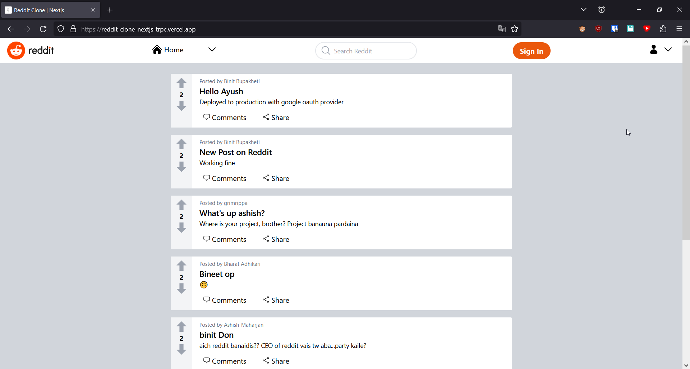
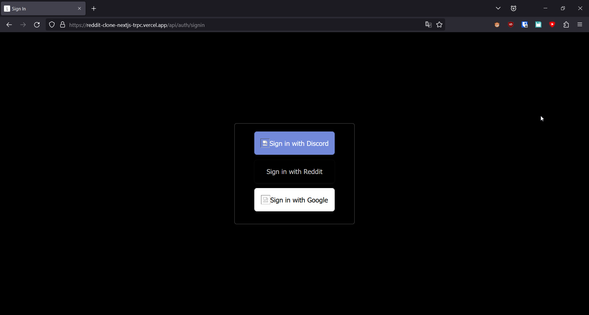
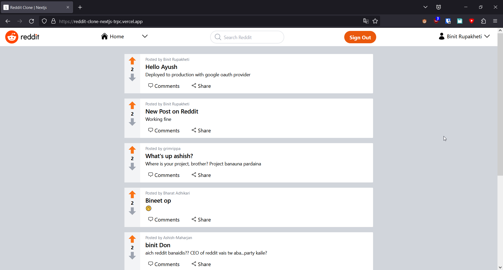
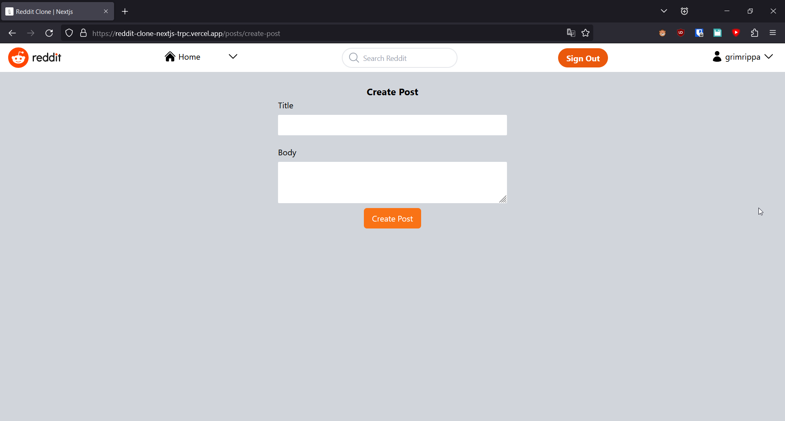
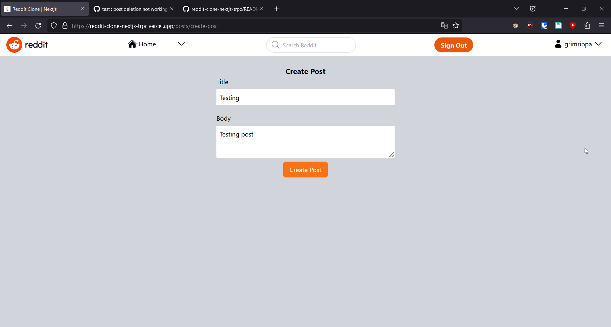
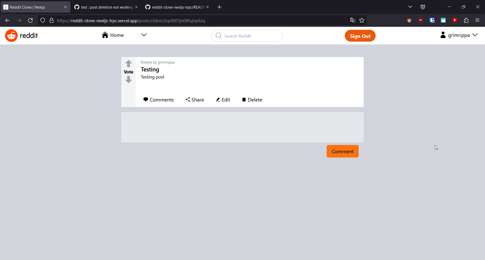
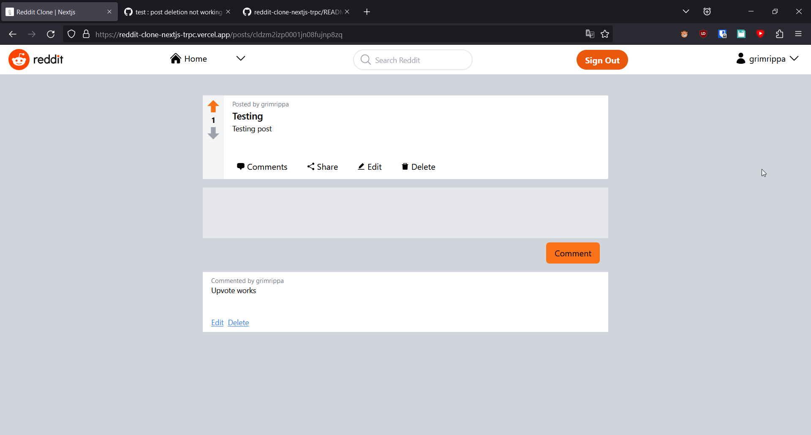
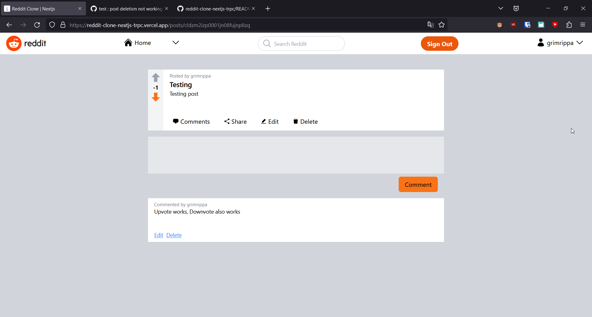
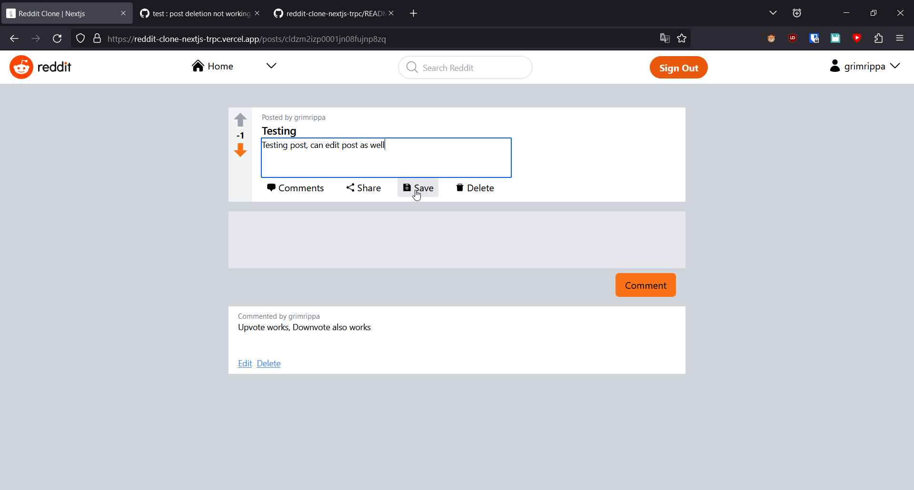
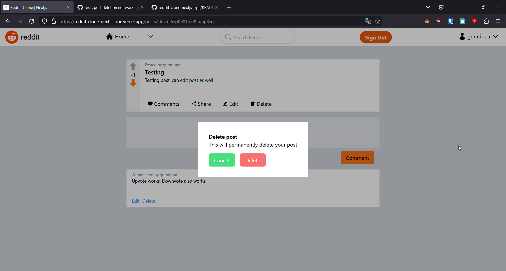
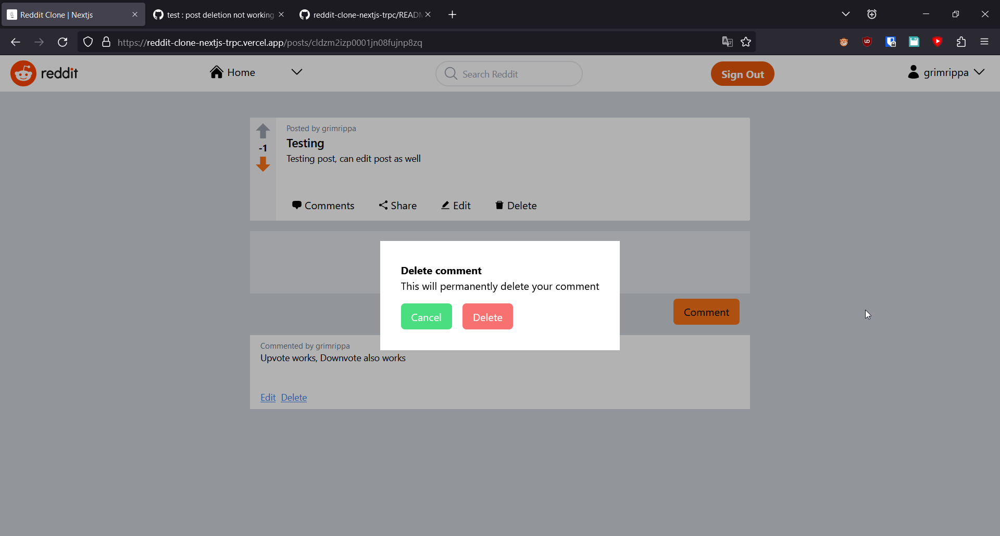
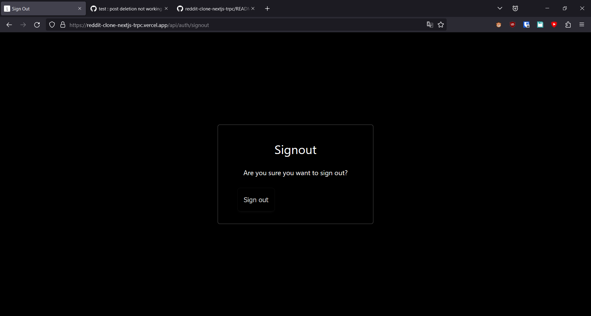
